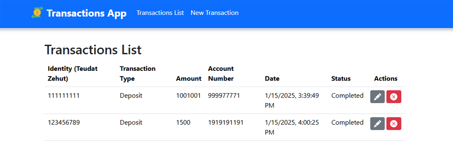

# 💱 Transactions App

## 📋 Overview
This application can create transactions against a banking provider, and modify or delete historical transactions.  
Historical transactions are displayed in  a table with their information and possible actions.

- **Server Side:** .NET Core 8  
- **Client Side:** Vue.js 2  
- **Database:** MSSQL (SQL Server)

## ✅ Prerequisites
Before installing and running the application, please make sure that:

- **.NET 8** is installed on your computer.
- **Node.js** is installed on your computer.
- **SQL Server** is installed on your computed.
- The following ports are **not in use**:
  - **5001** (used by the server)
  - **8080** (used by the client)

## 🛠️ Installation
- Clone the project.

## 💸 Using the app
To start transactioningt, follow these steps:

- Navigate to the GUI application at [TransactionsApp (Click me!)](http://localhost:8080/).
- To add a new transaction, click on **New Transaction** in the app bar.
   
- Fill all of the fields according to the input restrictions and click on **Submit**.  
  After submittion it will show success / failure indication.
   
- Navigate to the transactions history by clicking on **Transactions List** in the app bar.
- This page will display all transactions history with their details.
   

### **Transaction actions:**
- **To modify a transaction**:
   - Click on the modification button.
   - You'll be redirected to the transaction form page.
   - Modify the enabled inputs and submit.
   
- **To cancel (delete) a transaction:**
   - Click on the cancelation button.
   - Confirm the confirmation window.
   - The transaction will be deleted (soft delete) from the list.
   

## 🧪 Run unit tests
- Go to `TransactionsApp.Server` folder inside the project.
- Execute `dotnet test` in a command line.

-------
