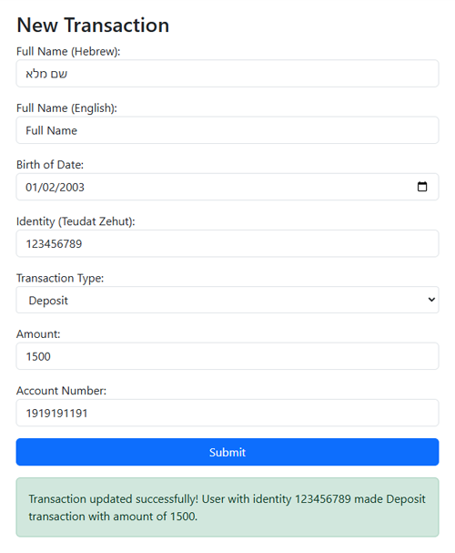
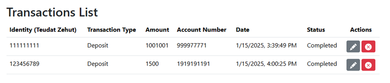
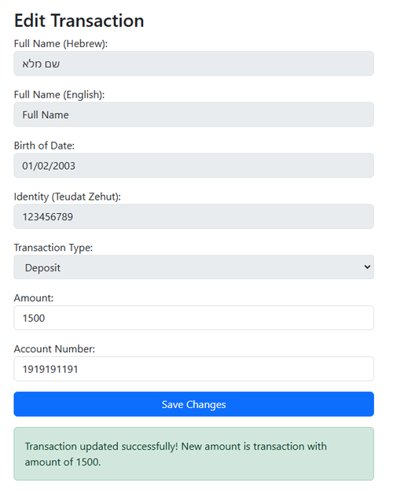

# 💱 Transactions App

## 📋 Overview
This application can create transactions against a banking provider, and modify or delete historical transactions.  
Historical transactions are displayed in  a table with their information and possible actions.

- **Server Side:** .NET Core 8  
- **Client Side:** Vue.js 2  
- **Database:** MSSQL (SQL Server)

## ✅ Prerequisites
Before installing and running the application, please make sure that:

- **.NET 8** is installed on your computer.
- **Node.js** is installed on your computer.
- **SQL Server** is installed on your computed.
- There's no **TransactionsAppDb** named database.
- The following ports are **not in use**:
  - **5001** (used by the server)
  - **8080** (used by the client)
- **Visual Studio** is installed on your computed.

## 🛠️ Installation
- Clone the project and navigate to the folder.
- ### **Setting up the Server**
   - Open the server solution in `TransactionsApp.Server` in Visual Studio.
   - Open the `appsettings.json` file in `TransactionsApp.API` folder.
   - Update the `ConnectionStrings` section to point to your SQL Server instance. Example:
   ````
     "ConnectionStrings": {
      "DefaultConnection": "Server=localhost;Database=TransactionsAppDb;Trusted_Connection=True;TrustServerCertificate=TrueMultipleActiveResultSets=true"
      }
   ````
   - Open **Package Manager Console** and select `TransactionsApp.Infrastructure.Implementations` as default project.
   - Execute the following command to apply migrations and create the database:
   ````
   Update-Database
   ````
   - In Visual Studio set `TransactionsApp.API` as the startup project.
   - Choose `http` as start type.
   - Run the application using **F5**.
 
   - The server should start at `http://localhost:5000` by default.
- ### **Setting up the Client**
   - Navigate to the client Folder `TransactionsApp.Client/transactions-app-client`.
   - Run the following command to install all required dependencies:
   ````
   npm install
   ````
   - Start the client using the following command:
   ````
   npm run serve
   ````
   - The client should be available at `http://localhost:8080` by default.

## 💸 Using the app
To start transactioningt, follow these steps:

- Navigate to the GUI application at [TransactionsApp (Click me!)](http://localhost:8080/).
- To add a new transaction, click on **New Transaction** in the app bar.
   
- Fill all of the fields according to the input restrictions and click on **Submit**.  
  After submittion it will show success / failure indication.
   
- Navigate to the transactions history by clicking on **Transactions List** in the app bar.
- This page will display all transactions history with their details.
   

### **Transaction actions:**
- **To modify a transaction**:
   - Click on the modification button.
   - You'll be redirected to the transaction form page.
   - Modify the enabled inputs and submit.
   
- **To cancel (delete) a transaction:**
   - Click on the cancelation button.
   - Confirm the confirmation window.
   - The transaction will be deleted (soft delete) from the list.
   


## 🧪 Run unit tests
- Go to `TransactionsApp.Server` folder inside the project.
- Execute `dotnet test` in a command line.

-------
